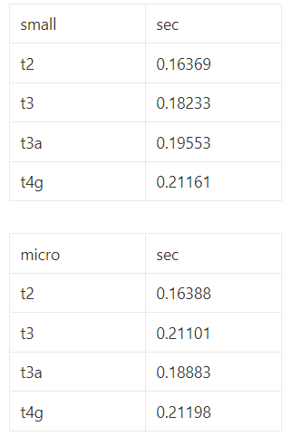

# instancerepo

## 실행 코드

    import requests
    from bs4 import BeautifulSoup

    def get_username_and_email(url):
        response = requests.get(url)
        soup = BeautifulSoup(response.text, 'html.parser')

        # 사용자 이름이 포함된 HTML 요소를 찾습니다.
        username = soup.find('h1').text

        # 이메일 주소가 포함된 HTML 요소를 찾습니다.
        email_tag = soup.find('a', href=lambda x: x and x.startswith('mailto:'))    if email_tag:
            email = email_tag['href'].replace('mailto:', '')
        else:
            email = '이메일 주소를 찾을 수 없습니다.'

    return username, email

    url = 'https://baebyeolha.github.io/baebyeolha/'
    username, email = get_username_and_email(url)
    print(f'Username: {username}')
    print(f'Email: {email}')
    print ('\n')

    url1 = 'https://eunxoo.github.io/eunxoo/'
    username1, email1 = get_username_and_email(url1)
    print(f'Username: {username1}')
    print(f'Email: {email1}')
    print ('\n')

    url2 = 'https://seo-yj.github.io/SEO-YJ/'
    username2, email2 = get_username_and_email(url2)
    print(f'Username: {username2}')
    print(f'Email: {email2}')
    print ('\n')

    url3 = 'https://tomk2d.github.io/Tomk2d/'
    username3, email3 = get_username_and_email(url3)
    print(f'Username: {username3}')
    print(f'Email: {email3}')

    import math
    import time

    start = time.time()
    math.factorial(100000)
    end = time.time()

    print(f"{end - start:.5f} sec")

## 결과

t2 small 

 
t3 small 

 
t3a small 

 
t4g small 

 

t2 micro 

 
t3 micro 

 
t3a micro 

 
t4g micro 

## 결과 분석

### 아키텍처 차이

T3 인스턴스는 인텔 x86아키텍처, t3a 인스턴스는 AMD x86 아키텍처, T4g 인스턴스는 AWS Graviton의 프로세서로
아키텍처를 x86으로 설정했을 땐 t4g를 사용할 수 없고, arm으로 설정하면 t2,t3,t3a를 사용할 수 없었다

- micro 

- small 

small의 vPCU는 2, 메모리는 2GiB로 , micro의 vCPU는 2, 메모리는 1GiB로 버전별로 동일하다
하지만 x86에서 t2,t3,t3a 인스턴스 코드 실행 시간이 arm에서 t4g 인스턴스 코드 실행 시간보다 빠른 것을 알 수 있다

