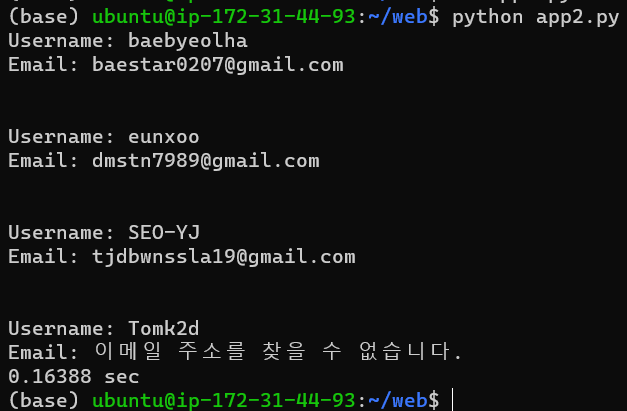

# instancerepo

## 실행 코드

    import requests
    from bs4 import BeautifulSoup

    def get_username_and_email(url):
        response = requests.get(url)
        soup = BeautifulSoup(response.text, 'html.parser')

        # 사용자 이름이 포함된 HTML 요소를 찾습니다.
        username = soup.find('h1').text

        # 이메일 주소가 포함된 HTML 요소를 찾습니다.
        email_tag = soup.find('a', href=lambda x: x and x.startswith('mailto:'))    if email_tag:
            email = email_tag['href'].replace('mailto:', '')
        else:
            email = '이메일 주소를 찾을 수 없습니다.'

    return username, email

    url = 'https://baebyeolha.github.io/baebyeolha/'
    username, email = get_username_and_email(url)
    print(f'Username: {username}')
    print(f'Email: {email}')
    print ('\n')

    url1 = 'https://eunxoo.github.io/eunxoo/'
    username1, email1 = get_username_and_email(url1)
    print(f'Username: {username1}')
    print(f'Email: {email1}')
    print ('\n')

    url2 = 'https://seo-yj.github.io/SEO-YJ/'
    username2, email2 = get_username_and_email(url2)
    print(f'Username: {username2}')
    print(f'Email: {email2}')
    print ('\n')

    url3 = 'https://tomk2d.github.io/Tomk2d/'
    username3, email3 = get_username_and_email(url3)
    print(f'Username: {username3}')
    print(f'Email: {email3}')

    import math
    import time

    start = time.time()
    math.factorial(100000)
    end = time.time()

    print(f"{end - start:.5f} sec")

## 결과

t2 small 

t3 small 

t3a small 

t4g small 

t2 micro 

t3 micro 

t3a micro 

t4g micro 

## 결과 분석

### 1. t_ 차이
- T2 인스턴스가 가장 빠른 시간을 기록한 것은, 이 인스턴스가 필요에 따라 CPU 사용량을 순간적으로 확장할 수 있기 때문 

- T3a 인스턴스가 두 번째로 빠른 시간을 기록한 것은, 이 인스턴스가 AMD EPYC 7000 시리즈 프로세서를 사용하며, T3 인스턴스보다 10%의 비용을 절감하면서도 높은 성능을 제공하기 때문 

- T3와 T4g 인스턴스가 비슷한 시간을 기록한 것은, 두 인스턴스 유형이 모두 높은 CPU 성능을 제공하기 때문 

### 2. small과 micro 차이

small이 micro보다 메모리(GiB)가 2배이기때문에 small이 더 빠르다

